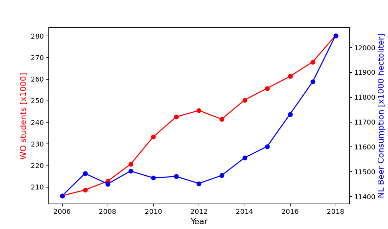

### Titles papers

- MCC Van Dyke et al., 2019
- JT Harvey, Applied Ergonomics, 2002
- DW Ziegler et al., 2005

As seen in the above graph there is hardly a correlation between the consumption of beer and the amount of students in the Netherlands. 